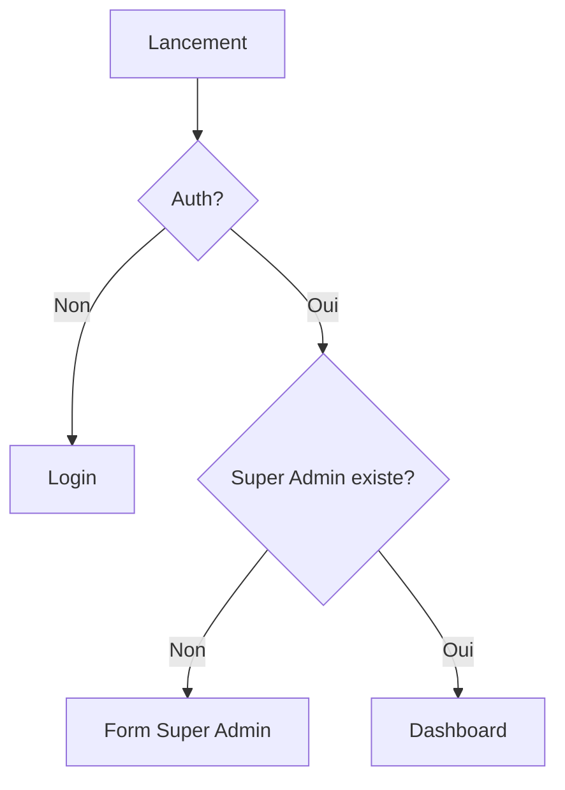

# 🚀 Guide d'Initialisation de l'Application

## 1. Point d'Entrée (`main.tsx`)
Le lancement commence ici avec les providers essentiels :
```tsx
<BrowserRouter>
  <WorkflowProvider>
    <ThemeProvider>
      <App />
    </ThemeProvider>
  </WorkflowProvider>
</BrowserRouter>
```

## 2. Composant App (`App.tsx`)
Gère la logique initiale et le routage :
```tsx
const AppContent = () => {
  const { isChecking, currentStep } = useWorkflowCheck();

  if (isChecking) {
    return <LoadingScreen message="Vérification initiale..." />;
  }

  if (currentStep !== "dashboard") {
    return <InitializationWizard startStep={currentStep} />;
  }

  return <Dashboard />;
};
```

## 3. Hook useWorkflowCheck (`hooks/useWorkflowCheck.ts`)
Vérifie l'état d'initialisation :
- Vérifie l'authentification Supabase
- Vérifie l'existence d'un Super Admin
- Détermine l'étape de démarrage

## 4. Workflow Provider (`contexts/WorkflowProvider.tsx`)
Gère l'état global du workflow :
- État actuel (`currentStep`)
- Étapes complétées
- Progression du workflow

## 5. Aiguillage des Étapes

### 5.1 Vérification Initiale


### 5.2 États Possibles
- `init`: Vérification initiale
- `super_admin_check`: Création Super Admin nécessaire
- `organization_setup`: Configuration organisation
- `completed`: Configuration terminée

## 6. Composant InitializationWizard
Affiche le formulaire approprié selon l'étape :
```tsx
const renderCurrentStep = () => {
  switch (currentStep) {
    case 'super_admin_check':
      return <SuperAdminSetupModal />;
    // ...autres étapes
  }
};
```

## 7. Base de Données

### 7.1 Tables Essentielles
- `workflow_states`: État du workflow
- `super_admins`: Super Administrateurs
- `profiles`: Profils utilisateurs

### 7.2 Politique RLS
```sql
CREATE POLICY "super_admins_policy" ON "public"."super_admins"
FOR ALL USING (
  CASE 
    WHEN NOT EXISTS (SELECT 1 FROM super_admins) THEN true
    WHEN auth.uid() IN (SELECT user_id FROM super_admins) THEN true
    ELSE false
  END
);
```

## 8. Points de Vérification

### 8.1 Authentification
- ✅ Session Supabase valide
- ✅ Token JWT valide

### 8.2 Super Admin
- ✅ Table `super_admins` accessible
- ✅ Vérification existence Super Admin

### 8.3 Workflow
- ✅ État workflow récupéré
- ✅ Étape courante déterminée

## 9. Dépannage

### 9.1 Erreurs Communes
- 🚫 `useWorkflow must be used within a WorkflowProvider`
  → Vérifier l'ordre des providers

- 🚫 `Auth session missing`
  → Vérifier la configuration Supabase

### 9.2 Commandes Utiles
```bash
# Vérifier les logs Supabase
supabase logs

# Réinitialiser le workflow (dev uniquement)
supabase db reset --db-only
```

## 10. Variables d'Environnement
```env
VITE_SUPABASE_URL=votre_url
VITE_SUPABASE_ANON_KEY=votre_clé
```